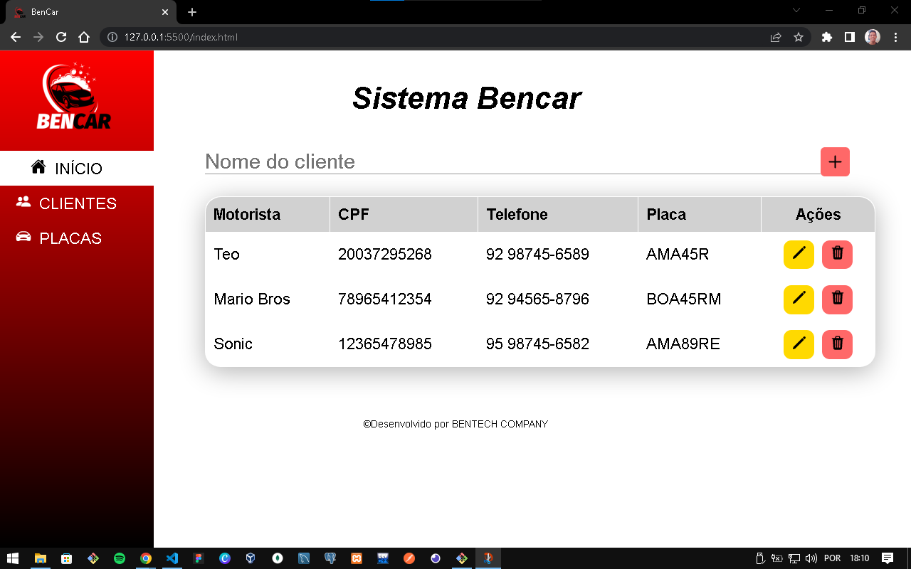
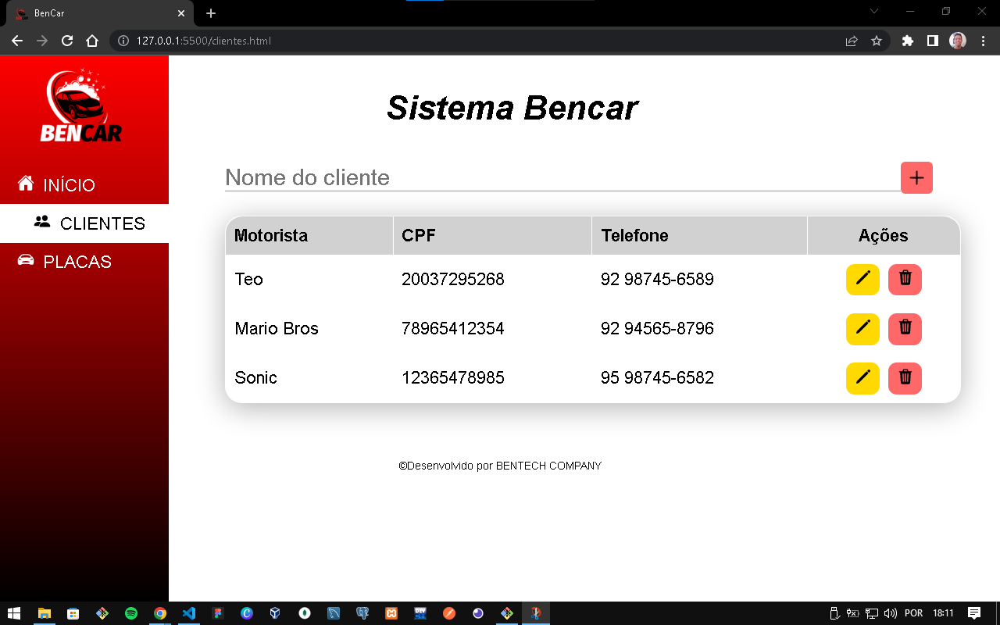

# BenCar

Sistema CRUD para controle de motoristas cadastrados no banco de dados

Nesse projeto, utilizei:
    HTML, CSS, JavaScript, JQuery, método Fetch (Para requisição HTTP)

A API usada neste projeto está nesse repositório [BencarAPI](https://github.com/timoteobentes/bencar-api)

Interfaces apresentadas:

## Inicio

## Clientes

## Placas

Autor: Timóteo Bentes